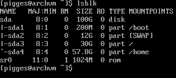
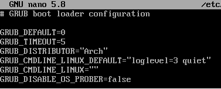
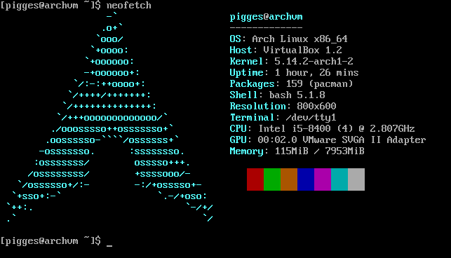

# **Arch Install Guide**

#### This is a guide about how to install *Arch Linux* from start to finish in one place. If you follow these steps you will end up with an clean install of *Arch Linux* without any graphical environment. 

### Keep in mind that this guide is made for *BIOS* and not *UEFI* systems
* Check if you have a *UEFI* system: 
    ```shell
    $ ls /sys/firmware/efi/efivars
    ```
    *   If the command shows you the directory without any error, then you have a *UEFI* system. But you may still be able to follow this guide to some extent. 
    
    *   If you got an error that looks like this, then you are good to go and can follow this guide. 
        ```
        ls: cannot access '/sys/firmware/efi/efivars': No such file or directory
        ```

## Pre install steps

### 1. Set the keyboard layout

*   Find keyboard layout: 
    ```shell
    $ ls /usr/share/kbd/keymaps/**/*.map.gz
    ```

*   Set the keyboard layout example: 
    ```shell
    $ loadkeys sv-latin1
    ```

### 2. Connect to the internet

*   Enable the network interface: 
    ```shell
    $ ip link
    ```

*   Verify that it works: 
    ```shell
    $ ping pigges.xyz
    ```

### 3. Update the system clock

*   Enable the clock service: 
    ```shell
    $ timedatectl set-ntp true
    ```

*   Check the service status: 
    ```shell
    $ timedatectl status
    ```

### 4. Partition the disks

*   Check what disks are connected: 
    ```shell
    $ lsblk
    ```
    

    |Example for `lsblk`: |
    |:-:|
    ||

*   Enter fdisk: 
    ```shell
    $ fdisk /dev/sda
    ```

    *   Example partition layout for a 100GB disk: 
        | NAME   |  SIZE   | TYPE |  MOUNT  |
        |:-------|:-------:|:----:|--------:|
        | sda    |  `100G` | disk |         |
        | ├─sda1 |  `200M` | part | `/boot` |
        | ├─sda2 |   `12G` | part | `[SWAP]`|
        | ├─sda3 |   `30G` | part | `/`     |
        | └─sda4 | `57.8G` | part | `/home` |


### 5. Format the partitions

*   Make filesystem for all the partitions exept for the `SWAP` partition: 
    ```shell
    $ mkfs.ext4 /dev/sdaX
    ```

*   Make and enable `SWAP`: 
    ```shell
    $ mkswap    /dev/sda2

    $ swapon    /dev/sda2
    ```

### 6. Mount file systems

*   Mount the root partition to `/mnt`: 
    ```shell
    $ mount /dev/sda1   /mnt
    ```

*   Create directories for partitions: 
    ```shell
    $ mkdir /mnt/boot

    $ mkdir /mnt/home
    ```

*   Mount the other partitions
    ```shell
    $ mount /dev/sda1   /mnt/boot

    $ mount /dev/sda4   /mnt/home
    ```

## Install steps

### 1. Run the install command with `pacstrap`

```shell
$ pacstrap /mnt base base-devel linux linux-firmware nano
```
    

### 2. Generate fstab file and Chroot to the disk

*   Generate an fstab file: 
    ```shell
    $ genfstab -U /mnt >> /mnt/etc/fstab
    ```

*   Chroot into the disk
    ```shell
    $ arch-chroot   /mnt
    ```

## Post install steps

### 1. Set Time Zone

* Check Region and City:
    ```shell
    $ ls /usr/share/zoneinfo # Get the REGION
    
    $ ls /usr/share/zoneinfo/REGION # Get the CITY
    ```

*   Set Region and City
    ```shell
    $ ln -sf /usr/share/zoneinfo/REGION/CITY /etc/localtime
    ```

*   Run hwclock to generate `/etc/adjtime`: 
    ```shell
    $ hwclock --systohc
    ```

### 2. Setup localization

*   Edit `/etc/locale.gen` and uncomment the locales you may need: 
    ```shell
    $ nano /etc/locale.gen
    ```
    Example for `/etc/locale.gen`: 
    ```
    en_US.UTF-8 UTF-8
    sv_SE.UTF-8 UTF-8
    ```

*   Generate the locales: 
    ```shell
    $ locale-gen
    ```

*   Create and setup the `/etc/locale.conf` file: 
    ```shell
    $ nano /etc/locale.conf
    ```

    Example for `/etc/locale.conf`:  
    ```
    LANG=en_US.UTF-8
    ```

*   Set keyboard layout: 
    ```shell
    $ nano /etc/vconsole.conf
    ```

    Example for `/etc/vconsole.conf`: 
    ```
    KEYMAP=sv-latin1
    ```

### 3. Network configuration

*   Install and enable `networkmanager`: 
    ```shell
    $ pacman -S networkmanager

    $ systemctl enable NetworkManager
    ```

*   Create the `/etc/hostname` file: 
    ```shell
    $ nano /etc/hostname.conf
    ```

    Example for `/etc/hostname`: 
    ```
    archvm
    ```

*   Edit the `/etc/hosts` file: 
    ```shell
    $ nano /etc/hosts
    ```

    Example for `/etc/hosts`: Change "archvm" to your hostname
    ```
    # Static table lookup for hostnames.
    # See hosts(5) for details.

    127.0.0.1       localhost
    ::1             localhost
    127.0.1.1       archvm.localdomain      archvm
    ```

### 4. Root password

*   Set a root password
    ```shell
    $ passwd
    ```

### 5. Setup a bootloader 'GRUB'

*   Install `grub`
    ```shell
    $ pacman -S grub

    $ grub-install --target=i386-pc /dev/sda
    ```

*   Configure `grub`
    ```shell
    $ grub-mkconfig -o /boot/grub/grub.cfg
    ```

    *   If you get this warning: 
        ```
        Warning: os-prober will not be executed to detect other bootable partitions.
        Systems on them will not be added to the GRUB boot configuration.
        Check GRUB_DISABLE_OS_PROBER documentation entry.
        done
        ```

        Edit the `/etc/default/grub` file: 
        ```shell
        $ nano /etc/default/grub
        ```

        *   Add this line: 
            ```
            GRUB_DISABLE_OS_PROBER=false
            ```
        
            |Example for `/etc/default/grub`: |
            |:-|
            ||

        Then run this again: 
        ```shell
        $ grub-mkconfig -o /boot/grub/grub.cfg
        ```

### 6. Setup a user

*   Create the user: 
    ```shell
    useradd -m -G wheel user #change user
    ```

*   Set a user password: 
    ```shell
    $ passwd user
    ```

*   Edit the `sudo` config so users of the `wheel` group can use sudo: 
    ```shell
    $ EDITOR=nano visudo
    ```

    *   Find the line where it says "`# %wheel ALL=(ALL) ALL`" and uncomment it. 

### 7. Exit and shutdown

*   Exit from `chroot`:
    ```shell
    $ exit
    ```

*   Unmount the disk:
    ```shell
    $ umount -R /mnt
    ```

*   Shutdown the computer: 
    ```shell
    $ shutdown now
    ```

### 8. Done!
You can now remove the install media and boot into your newly made arch install and be prompted with a login. 

|BTW I use Arch|
|:-:|
| |